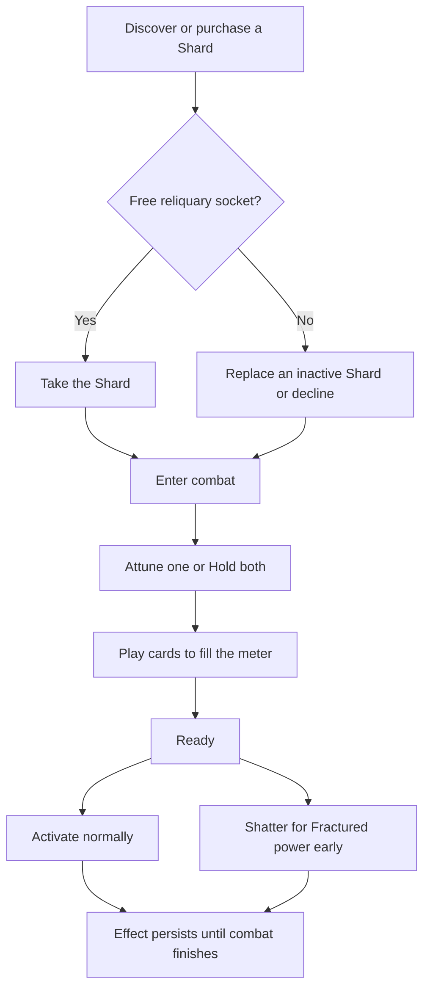
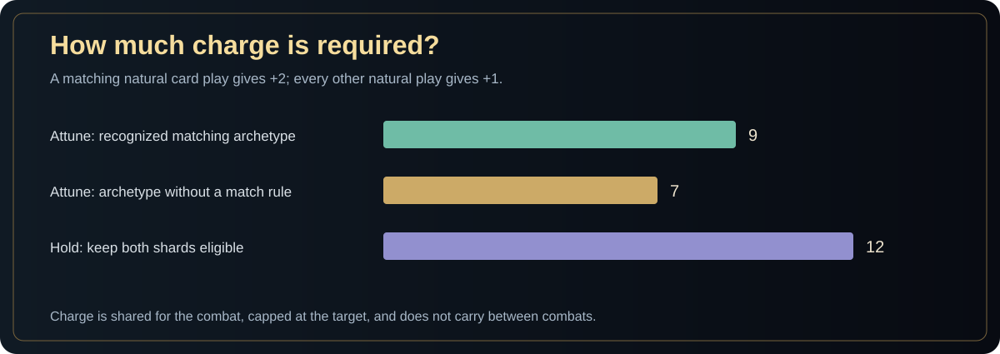
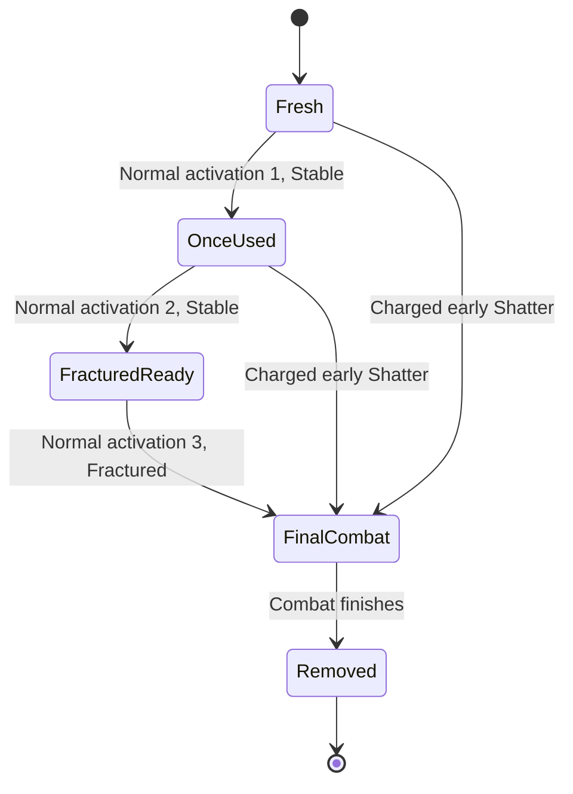

<a href="README.md">Main README</a> · <a href="#charge-and-attunement">Charge rules</a> · <a href="#complete-shard-catalog">All 30 Shards</a> · <a href="#implementation-map">Implementation map</a>

# Fate Shards

**A combat-long power, earned through card play and spent across the run.** Fate Shards occupy the two-slot reliquary. They change how your existing deck works: amplify Strength, convert Block into damage, repeat cards, reward Exhaust, or turn a ritual into an engine.

This guide documents the current implementation under `Assets/`. It replaces the old batch-1/batch-2 ZIP installation note. **There is no separate overhaul ZIP to install for this checkout.** Root upload variants remain in place during the ongoing transfer; see the [upload inventory](Archive/README.md). The live Unity files are the source of truth.

## The rules at a glance

| Rule | Current behavior |
|---|---|
| Catalog | 30 Shard definitions, each with a Stable and Fractured effect |
| Capacity | Carry 2 Shards in persistent sockets |
| Combat limit | Activate at most 1 Shard per combat |
| Charging | Natural card plays give +1; a recognized matching archetype gives +2 |
| Readiness | Shared meter must reach its target before activation or Shatter |
| Duration | The awakened effect lasts for the remainder of that combat |
| Ordinary lifespan | First 2 activations are Stable; the 3rd is Fractured |
| Consumption | Third-use or early-Shattered Shards are removed when the active combat finishes |
| Early Shatter | Take Fractured power now and forfeit every remaining use |
| Persistence | Charge, attunement, activation, and counters travel with combat checkpoints |

## From discovery to awakening

Rewards, merchant offers, and events can introduce Shards. The discovery screen lets you take, replace, or leave an offered Shard. A full inventory does not silently destroy an existing one. The current merchant Shard offer costs **45 Gold**; event conditions and reward rolls are defined separately.

## Charge and attunement

One usable Shard attunes automatically. With two usable Shards, the pre-battle screen offers either individual Shard or **Hold**. Individual attunement limits activation to that chosen Shard. Hold keeps both eligible, but you must still choose only one to awaken.

| Choice | Charge target | Tradeoff |
|---|---:|---|
| Attune an archetype with a matching rule | 9 | Matching natural plays give +2; other natural plays give +1 |
| Attune an archetype with no matching rule | 7 | All natural plays give +1 |
| Hold both Shards | 12 | A play matching either held Shard gives +2; otherwise +1 |

**The 7-charge target depends on the engine's archetype rule, not on scanning the current deck.** A Strength Shard still uses the 9-charge target even if your deck has no Strength cards. Cost, Momentum, Multi-hit, Consume, Echo, Sequence, and Curse currently have no specialized match rule and use the base rate when individually attuned.

Charge belongs to the encounter, persists across its turns, caps at the target, and stops increasing after a Shard activates. It does not carry into the next combat. Automatic replays do not generate a second natural-play charge.

### Exactly what counts as a match?

The matcher checks a card's **primary effect**, type, original cost, or persistent modification as shown below. Keywords and secondary effects do not generally substitute for the listed condition.

| Engine archetype | Match condition |
|---|---|
| Strength | Primary effect is Strength |
| Block | Primary effect is Block or Fortify |
| Attack | Card type is Attack |
| Heavy | Attack with original cost 2+, or with the Heavy keyword |
| Retaliate | Primary effect is Retaliate or Block |
| Burn | Primary effect is Burn |
| Debuff | Primary effect is Mark, Vulnerable, Weak, or Burn |
| Exhaust | Card has the Exhaust flag, or primary effect is Exhaust |
| Draw | Primary effect is Draw |
| Energy | Primary effect is Energy |
| Modified | `CardDef.IsModified` is true |
| All other archetypes | No specialized match; +1 natural-play charge |

### Charge examples

| Situation | Natural plays needed from empty |
|---|---:|
| Attuned Ironheart: only matching Block/Fortify cards | 5 plays: 2 + 2 + 2 + 2 + 2, capped at 9 |
| Attuned Ironheart: no matching plays | 9 plays |
| Attuned Echo: no special match rule | 7 plays |
| Hold Ironheart and Emberglass: every play matches one | 6 plays to reach 12 |

These examples assume all plays are accepted naturally by the model. They do not imply the deck can afford that many plays in one turn.

## Stable, Fractured, and Shatter

| Before activation | `uses` | Effect if activated normally | State afterward |
|---|---:|---|---|
| Fresh | 0 | Stable | 1 use consumed |
| Used once | 1 | Stable | 2 uses consumed; Fractured for the next activation |
| Used twice | 2 | Fractured | 3 uses consumed; active until combat cleanup |
| Any eligible Stable Shard, early Shatter | 0 or 1 | Fractured | Set to 3 uses; removed after combat |

Fracturing after the second activation changes the **next** activation. It does not retroactively upgrade the Stable effect already active in the second combat.

**Hold is an attunement choice. HOLD TO SHATTER is an activation action.** They are separate decisions. Shatter still requires a full meter and an eligible attuned Shard. On the mouse interface, holding the Shatter button for **0.9 seconds** confirms it. The final ordinary use already grants Fractured power, so it has no separate early-Shatter button.

## Complete Shard catalog

The effect text below comes from [WorldContent.FateShards](Assets/Scripts/Core/WorldContent.cs), checked on **7 October 2026**. Stable and Fractured effects are alternatives for an activation, rather than two separately equipped powers. Per-turn and per-combat limits in the text matter.

| Shard | Engine archetype | Stable effect | Fractured effect |
|---|---|---|---|
| **Bloodstone** (`bloodstone`) | Strength | Whenever you gain Strength, gain 1 additional Strength. | On activation, gain 3 Strength. Whenever you gain Strength, gain 2 additional Strength. |
| **Ironheart** (`ironheart`) | Block | Whenever a card gives 10+ Block, gain 50% of that Block again. | Whenever a card gives Block, gain that amount again. |
| **Quickglass** (`quickglass`) | Cost | The first card drawn each turn with an original cost of 2+ costs 0 that turn. | The first 2 cards drawn each turn with an original cost of 2+ cost 0 that turn. |
| **Crooked** (`crooked`) | Cost | Every 4th card played each turn costs 0 before being played. | Every 3rd card played each turn costs 0 and draws 1 after resolving. |
| **Hourglass** (`hourglass`) | Energy | Retain unused Energy between turns, up to 2. | Retain ALL unused Energy. On activation, gain 2 Energy. |
| **Silvermind** (`silvermind`) | Draw | On activation, draw 2 cards. Your first extra draw each turn draws 1 more. | On activation, draw 2 cards. Draw 2 additional cards EVERY turn. |
| **Golden Shield** (`golden_shield`) | Block | The first Block gain each turn is gained again. | The first 2 Block gains each turn are gained again. |
| **Execution** (`execution`) | Attack | Attacks deal 50% more damage to enemies below 30% HP. | Attacks deal DOUBLE damage to enemies below 50% HP. |
| **Firstblood** (`firstblood`) | Attack | Your first Attack each turn deals 50% more damage. | Your first Attack each turn plays twice. |
| **Balanced** (`balanced`) | Block | End your turn at exactly 0 Energy: gain 12 Block and draw 1 additional card next turn. | End at exactly 0 Energy: gain 20 Block, +1 Energy next turn and +2 draw next turn. |
| **Giantglass** (`giantglass`) | Heavy | Your first Attack costing 2+ each turn deals 50% more damage. | ALL Attacks with an original cost of 2+ deal 75% more damage. |
| **Thousand-Cut** (`thousand_cut`) | Multi-hit | Multi-hit Attacks gain +3 damage PER HIT. | Multi-hit Attacks gain +5 per hit and their final hit deals double damage. |
| **Rhythm** (`rhythm`) | Momentum | Every 4th Attack played each turn plays twice. | Every 3rd Attack played each turn plays twice. |
| **Duelist** (`duelist`) | Heavy | Your first Attack each turn deals 75% more damage. | Your first Attack each turn deals DOUBLE damage. If it is your only Attack that turn, draw 2 at the end of the turn. |
| **Aftershock** (`aftershock`) | Heavy | After an Attack costing 2+, your next Attack this turn costs 0 and deals +8 damage. | After an Attack costing 2+, your next 2 Attacks this turn cost 0 and deal +12 damage. |
| **Bastion** (`bastion`) | Block | Whenever a single card gives 15+ Block, gain 1 Fortify and draw 1. | Whenever a single card gives 10+ Block, gain 2 Fortify and draw 1. Up to 3 triggers per turn. |
| **Thorn** (`thorn`) | Retaliate | Whenever an enemy damages your Block, deal 10 damage back. | Whenever an enemy damages your Block, deal 20 damage back and regain 25% of the Block lost from that hit. |
| **Overflow** (`overflow`) | Block | Retain up to 15 Block between turns. | Retain ALL remaining Block between turns. |
| **Counterweight** (`counterweight`) | Block | Every 15 Block gained during a turn gives your next Attack +12 damage. Stacks. | Every 10 Block gained gives your next Attack +15 damage. Stacks without a per-turn limit. |
| **Emberglass** (`emberglass`) | Burn | The first Burn application each turn is applied TWICE. | Every second Burn application is applied TWICE. |
| **Ash** (`ash`) | Burn | The first time Burn deals damage each turn, trigger 50% of that enemy's remaining Burn again. | The first time EACH enemy's Burn deals damage each turn, trigger its FULL remaining Burn again. |
| **Omen** (`omen`) | Debuff | The first stackable debuff applied each turn gains DOUBLE stacks. | The first 3 stackable debuffs applied each turn gain DOUBLE stacks. |
| **Executioner'S** (`executioners`) | Consume | Consuming or removing enemy debuff stacks with your effects deals 6 damage per stack. | Deal 12 damage per stack consumed. Draw 1 after consuming debuffs, up to 2 bonus draws per turn. |
| **Affliction** (`affliction`) | Debuff | Attacks deal +4 damage per different debuff on their target. | Attacks deal +8 per different debuff. The first Attack against a debuffed enemy each turn plays twice. |
| **Echo** (`echo`) | Echo | Every 4th card played each turn plays twice. Replays do not advance this counter. | Every 3rd card played each turn plays twice. Replays do not advance this counter. |
| **Hollow** (`hollow`) | Exhaust | The first card Exhausted each turn draws 2 cards. | The first 3 cards Exhausted each turn each draw 2 cards. |
| **Greedy** (`greedy`) | Draw | Each card drawn outside normal start-of-turn draw gives your next Attack +4 damage this turn. Stacks. | Each extra card drawn gives your next Attack +8 damage. Every third extra draw restores 1 Energy. |
| **Cycle** (`cycle`) | Sequence | Complete an Attack + Skill + Power set in a turn: draw 2 and gain 1 Energy. Once per turn. | Complete up to 3 NEW Attack + Skill + Power sets per turn. Each draws 2 and grants 1 Energy. |
| **Voidglass** (`voidglass`) | Curse | The first Curse or Status drawn each turn immediately Exhausts. Draw 1 and gain 8 Block. | The first 3 Curses or Statuses drawn each turn immediately Exhaust. Each draws 1, grants 10 Block and 1 Energy. |
| **Fatebreaker** (`fatebreaker`) | Modified | The first permanently modified card played each turn plays twice. Bindings qualify. | The first 2 modified cards each turn play twice and draw 1 after resolving. Replays cannot trigger this again. |

### Choosing a Shard for a build

| Build direction | Shards to inspect | Setup that matters |
|---|---|---|
| Strength engine | Bloodstone | Repeated Strength gains; activate before the gains you want amplified |
| Defensive conversion | Ironheart, Golden Shield, Bastion, Counterweight, Overflow | Block amount, source, retention, and the order of follow-up attacks |
| Heavy attacks | Giantglass, Aftershock, Duelist | Original cost, first-attack sequencing, and subsequent attacks |
| Fast attack chains | Firstblood, Rhythm, Thousand-cut | Natural attack count and individual hit structure |
| Burn or debuff ritual | Emberglass, Ash, Omen, Executioner's, Affliction | Applications, damage triggers, different debuff types, and consumption |
| Draw / Energy / cost engine | Quickglass, Crooked, Hourglass, Silvermind, Greedy, Balanced | Timing of draws, original cost, unused Energy, and exact zero-Energy turns |
| Replay / Exhaust / modifications | Echo, Hollow, Voidglass, Fatebreaker | Natural plays, Exhaust flags, Curse/Status draws, and eligible modified cards |
| Mixed card sequence | Cycle | Complete fresh Attack + Skill + Power sets within the turn |

These are navigation suggestions, not a ranking or a guarantee of an infinite combo. The model applies replay guards and individual trigger limits.

## Reliquary presentation and controls

- Two persistent sockets sit in the combat reliquary beside the Energy area.
- Charge rings, state labels, use pips, and a ready beacon show availability.
- With two usable Shards, the Attune screen supports arrows/Enter and D-pad or stick/A.
- Selecting a socket exposes activation information and, for an eligible Stable Shard, the mouse hold-to-Shatter action.
- Awakening and Shatter have different cinematics. Charge comets, hero auras, battlefield tint, and card glints communicate the active power.
- **Reduce Motion**, **Reduce Flashing**, **Reduced VFX**, and **Screen Shake** settings tone down the relevant effects.

The catalog art is stored in [FateShardIconAtlas_30.png](Assets/Resources/Art/FateShardIconAtlas_30.png), with sprite slicing in its `.meta` file. Retrieve Git LFS media before opening the project. The documentation diagrams are explanatory artwork, rather than screenshots of the combat UI.

## Persistence and safety rules

| State | Owner | Why it matters |
|---|---|---|
| Shard ID, socket, uses, active flags | `FateShardState` in `RunModel` | Stable identity across rooms and saves |
| Charge, attuned IDs, Hold, Shatter flag | `CombatState` | Reload cannot grant a free refill or a second activation |
| Shard effect counters and deferred resources | `ShardCombatMemory` | Replays, threshold progress, and next-turn gains restore consistently |
| Last individually attuned Shard | `RunModel.lastAttunedShardId` | Remembers selection preference; Hold clears it |
| Activation and use consumption | `AnimateShard` | Use count changes only after successful activation and is checkpointed |
| End-of-combat removal | `FinishActiveShard` | Removes spent active Shards; preserves unused sockets |

Activation is rejected when a card choice is pending, combat is over, it is not the player's phase, the meter is unready, attunement is unresolved, or another Shard is active. Discovery refuses invalid/full-inventory replacements and active-Shard replacement.

## Implementation map

| File | Responsibility |
|---|---|
| [WorldContent.cs](Assets/Scripts/Core/WorldContent.cs) | All 30 names, IDs, archetypes, and effect descriptions |
| [CombatShardCharge.cs](Assets/Scripts/Combat/CombatShardCharge.cs) | Targets, match rules, charge gain, attunement, and early Shatter |
| [CombatShards.cs](Assets/Scripts/Combat/CombatShards.cs) | Trigger memory, damage/Block/resource changes, repeats, and limits |
| [CombatModel.cs](Assets/Scripts/Combat/CombatModel.cs) | Natural-play charge and authoritative activation guard |
| [RunModel.cs](Assets/Scripts/Map/RunModel.cs) | Persistent Shard state, use-derived fracture, and cleanup |
| [RunRewards.cs](Assets/Scripts/Map/RunRewards.cs) | Capacity, discovery, replacement, and socket normalization |
| [GildedShardReliquary.cs](Assets/Scripts/UI/GildedShardReliquary.cs) | Attune screen, charge rings, labels, pips, and hold-to-Shatter |
| [GildedShardShrine.cs](Assets/Scripts/UI/GildedShardShrine.cs) | Discovery UI, merchant offer, socket art, and flights |
| [GildedCombatPresentation.cs](Assets/Scripts/UI/GildedCombatPresentation.cs) | Queued activation, animation sequence, use consumption, and checkpoints |
| [GildedShardVfx.cs](Assets/Scripts/UI/GildedShardVfx.cs) | Awakening/Shatter cinematics, comets, aura, tint, and glints |
| [GildedShardVerification.cs](Assets/Scripts/UI/GildedShardVerification.cs) | Targeted interaction, charge, final-use, socket, and save/reload checks |

## Verification checklist

1. With one Shard, confirm automatic attunement; with two, select either Shard and then Hold in separate combats.
2. Verify +1/+2 gains, 7/9/12 targets, cap behavior, and no charge from automatic replay.
3. Confirm unready and non-attuned activation is refused, and only one Shard activates.
4. Check Stable use 1, Stable use 2, Fractured use 3, and removal only during combat cleanup.
5. Early-Shatter a charged Stable Shard and confirm all future uses are forfeited.
6. Save/reload before and after activation, including active effect counters and fixed socket positions.
7. Replace a full inventory through discovery; confirm the other socket survives final-use removal.
8. Repeat affected presentation flows with reduced-effects settings and applicable controller input.

The existing verification suite provides targeted checks. This document is based on source inspection and does not claim that a fresh gameplay test was run when it was written.

---

[Back to Gilded Fate](README.md) · [Gameplay calculation rules](GILDED_FATE_GAMEPLAY_RULES.md) · [Archive notes](Archive/README.md)
