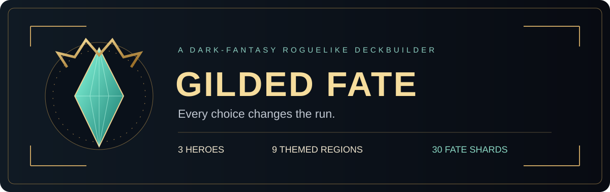
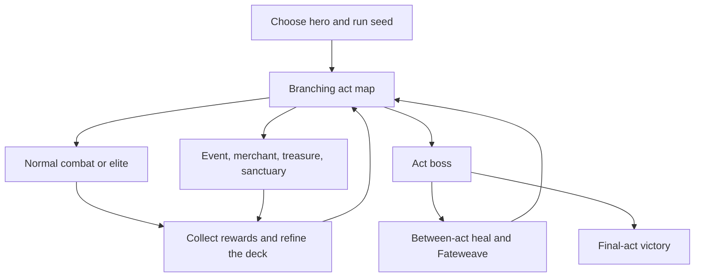
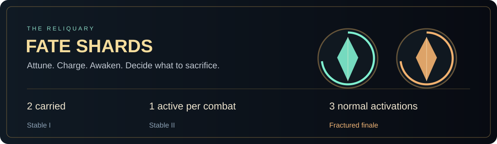
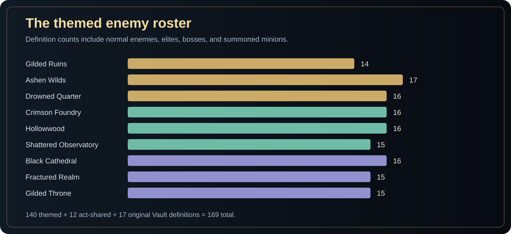
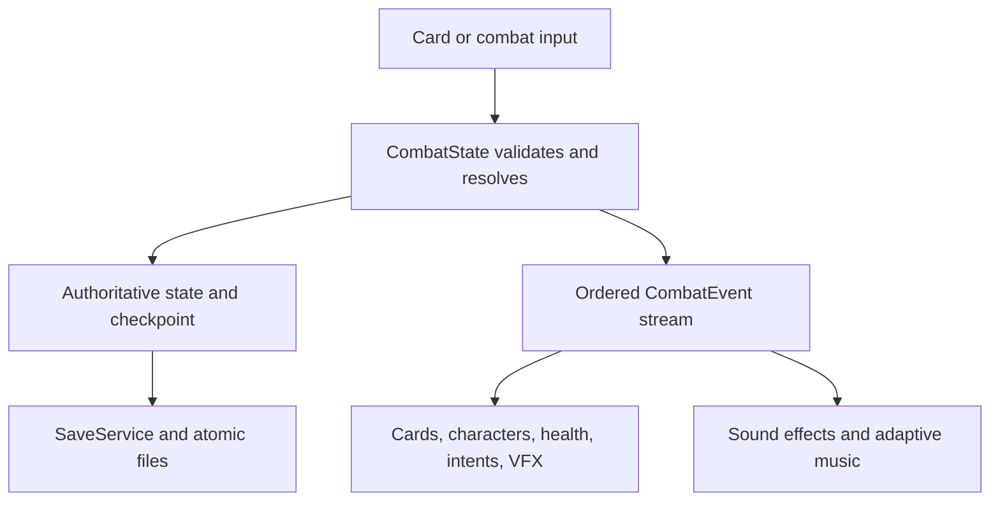

<p align="center"></p>

<p align="center"><strong>Choose a champion. Build a card engine. Survive the bargains of the Vault.</strong></p>

<p align="center">
<a href="https://github.com/riverhine1-max/gilded-fate/actions/workflows/build-game.yml"></a>


</p>

<p align="center"><a href="https://github.com/riverhine1-max/gilded-fate/releases/tag/playtest"><strong>Download Windows playtest</strong></a> · <a href="https://riverhine1-max.github.io/gilded-fate/">Play WebGL</a> · <a href="FATESHARD_OVERHAUL_README.md">Fate Shards guide</a> · <a href="#development">Open in Unity</a></p>

**Gilded Fate** is a dark-fantasy roguelike deckbuilder built in Unity. Lead the **Vanguard**, **Hexer**, or **Reaper** through three acts of branching routes, readable enemy intentions, and increasingly demanding encounters. Cards, relics, Bindings, Fateweaves, and Fate Shards combine into engines whose strength depends on sequencing and setup.

This repository is the Unity project. It contains the simulation, content catalogs, illustrated combat presentation, audio, video animation, persistence, verification tools, and cloud build workflows. It is under active development; content and balance can change between builds.

## Explore

| Start here | What you will find |
|---|---|
| [Playtesting](#playtesting) | Downloading, starting, and checking a build |
| [Heroes](#three-heroes-three-ways-to-break-the-vault) | Class identities and their main resources |
| [The run](#the-run) | Rooms, rewards, and between-act decisions |
| [Buildcraft](#buildcraft) | Cards, relics, Bindings, Fateweaves, and Shards |
| [Regions and enemies](#regions-and-enemies) | Nine themed regions and a source-counted roster chart |
| [Development](#development) | Unity setup, source layout, and build tooling |
| [Focused documentation](#focused-documentation) | Rules, progression, animation, Steam, and audit notes |

## Playtesting

### Windows

1. Open the [playtest release](https://github.com/riverhine1-max/gilded-fate/releases/tag/playtest).
2. Expand **Assets** and download **GildedFate-Windows.zip**.
3. Extract the entire ZIP to a folder.
4. Run **GildedFate.exe**, keeping its data directory and accompanying files beside it.

Unity is not required to play. **Pre-release** identifies a test build; it does not mean the download is waiting to finish. The release is updated in place, so its original publication time can be older than its latest ZIP. Check the asset timestamp and the **Built from** commit in the release notes.

### WebGL and build status

The [browser build](https://riverhine1-max.github.io/gilded-fate/) is deployed through a separate [WebGL deployment workflow](.github/workflows/deploy-webgl.yml). A Pages deployment may lag behind the game build.

The [build workflow](.github/workflows/build-game.yml) accepts **windows**, **webgl**, **windows+webgl**, **linux-trailer**, or **all**. Builds run one at a time within the matrix. A green Windows job means the Windows publish step finished even if another platform is still running. The Linux trailer target is a capture tool, rather than the Windows playtest download.

## Three heroes, three ways to break the Vault

<table><tr>
<td align="center"><br><strong>VANGUARD</strong></td>
<td align="center"><br><strong>HEXER</strong></td>
<td align="center"><br><strong>REAPER</strong></td>
</tr></table>

| Hero | Core resources | Typical build direction |
|---|---|---|
| **Vanguard** | Strength, Fortify, Block, Retaliate | Convert defensive setup into Heavy finishers; chain attacks and retaliation payoffs |
| **Hexer** | Burn, Marked, Resonance, Ember/Hex/Echo Sigils | Prepare rituals, consume debuffs, activate Sigils, and amplify delayed damage |
| **Reaper** | Souls, Exhaust, generated cards, Marked | Turn sacrifice and card recursion into resources and execution chains |

Every hero starts with a ten-card deck: four strikes, four defensive cards, and two signature cards. **Wanderer** cards provide a shared pool. Cross-character rewards and permanent card modifications can introduce tools beyond the starting class.

## The run



| Room | Why choose it? |
|---|---|
| Combat | Cards, Gold, and encounter reward rolls |
| Elite | Greater pressure with stronger reward potential |
| Event | Conditional bargains, transformations, and persistent consequences |
| Treasure | Relic rewards |
| Merchant | Spend Gold on cards, relics, removal, and available services |
| Sanctuary | Recover or improve the deck |
| Boss | Test the build and complete the act |

Maps and encounters use saved run state and seeded selection. Themed formations progress in difficulty through the act, and the encounter selector avoids repeating the exact same formation when alternatives exist. Combat supports **up to four living enemy bodies**, including summons.

## Buildcraft

| System | What it changes | Where to read the rules |
|---|---|---|
| **Cards and upgrades** | Damage, Block, costs, targets, keywords, and triggered effects | [Card catalogs](Assets/Scripts/Core/GameContent.cs) and [calculation rules](GILDED_FATE_GAMEPLAY_RULES.md) |
| **Relics** | Passive rules and resource loops across combats | [Base relics](Assets/Scripts/Core/GameContent.cs), [expansion relics](Assets/Scripts/Core/MajorRelics.cs) |
| **11 Bindings** | A permanent modifier attached to an eligible owned card | [WorldContent](Assets/Scripts/Core/WorldContent.cs) |
| **18 Fateweave definitions** | Act-tiered between-act choices, including rewards and card modifications | [WorldContent](Assets/Scripts/Core/WorldContent.cs) and [run flow](Assets/Scripts/Map/RunModel.cs) |
| **30 Fate Shards** | Charged, combat-long powers with Stable and Fractured forms | [Complete Shards guide](FATESHARD_OVERHAUL_README.md) |
| **Events** | HP, Gold, cards, relics, Shards, map knowledge, and temporary effects | [Event definitions](Assets/Scripts/Core/EventContent.cs) and [resolution](Assets/Scripts/Map/EventSystem.cs) |

Owned cards retain individual identities, so improving one copy does not rewrite every copy of the same card. Strong combinations emerge from costs, ordering, resources, and interactions rather than a single shared upgrade flag.

### Fate Shards at a glance



Carry **two**. Attune one before battle, or **Hold** both available at a higher charge target. Natural card plays fill a shared combat meter; matching plays charge faster. Awaken one Shard for the remainder of the encounter. Its first two normal activations use the Stable effect; the third uses its Fractured effect and consumes it. **Shatter** trades remaining uses for the Fractured power early.

→ [Read charge rules, all 30 effects, controls, persistence, and VFX details](FATESHARD_OVERHAUL_README.md).

## Regions and enemies

One theme is rolled for each act at run start. Act I uses its three themed regions. Acts II and III also retain the original **Gilded Vault** option. Act-shared enemies appear within the appropriate themed pools and use region-specific art variants.

| Act | Region | Combat identity | Region guide |
|---|---|---|---|
| I | Gilded Ruins | Seized wealth and formation priority | [Guide](Docs/GildedRuins.md) |
| I | Ashen Wilds | Pack instinct and living wilderness | [Guide](Docs/AshenWilds.md) |
| I | Drowned Quarter | Visible delayed threats | [Guide](Docs/DrownedQuarter.md) |
| II | Crimson Foundry | Heat and industrial pressure | [Guide](Docs/CrimsonFoundry.md) |
| II | Hollowwood | Growth and escalating organic threats | [Guide](Docs/Hollowwood.md) |
| II | Shattered Observatory | Prediction and future plans | [Guide](Docs/ShatteredObservatory.md) |
| III | Black Cathedral | Judgment, Sentence, and ritual | [Guide](Docs/BlackCathedral.md) |
| III | Fractured Realm | Echoes, repeats, splits, and loops | [Guide](Docs/FracturedRealm.md) |
| III | Gilded Throne | Royal Order, formations, and Reserve | [Guide](Docs/GildedThrone.md) |



**169 enemy definitions** are authored in the current catalogs: **140 themed**, **12 act-shared**, and **17 original Vault**. These counts include minions and special boss bodies; they are not counts of standalone random encounters. They were checked against the source catalogs on **7 October 2026**. Formations and act routing are separate from enemy definitions.

Sources: [WorldContent](Assets/Scripts/Core/WorldContent.cs), [ThemeRosters](Assets/Scripts/Core/DrownedQuarterContent.cs), [act-shared roster](Assets/Scripts/Core/NeutralContent.cs), and [encounter selection](Assets/Scripts/Core/EncounterContent.cs).

## Combat and presentation

Enemies show their planned intentions. Cards resolve through the authoritative model, which emits ordered events for the presentation layer. Damage numbers, status icons, character action, audio, card movement, and health playback follow those events.



The current combat presentation uses illustrated portraits and character video animation with fallback art. Authored 3D assets remain in the project, but the main combat startup keeps them dormant to maintain the illustrated composition. Runtime videos pack color and alpha side by side; dedicated shaders reconstruct transparency.

Accessibility options include **Reduce Motion**, **Reduce Flashing**, **Reduced VFX**, and **Screen Shake** settings. Mouse/keyboard and Xbox navigation have dedicated handling. A new run plays the hero introduction; continuing restores the saved run.

## Progression

- **Fate Marks** earned from runs unlock tiers of character and Wanderer cards.
- **Fate Debt I–X** adds cumulative difficulty after victories.
- **Daily Runs**, achievements, collection screens, statistics, and run history are present in the project.
- Run saves and combat checkpoints preserve the model state and support recovery paths.

See [Meta progression](Docs/MetaProgression.md) for thresholds, rewards, and difficulty rules. Steam integration has a separate [setup guide](Docs/SteamSetup.md); the presence of a guide should not be read as confirmation of a published Steam release.

## Development

### Open the Unity project

Requirements: **Unity Hub**, **Unity 6000.5.9f1**, **Git**, **Git LFS**, and the build-support module for your target platform.

```bash
git clone https://github.com/riverhine1-max/gilded-fate.git
cd gilded-fate
git lfs install
git lfs pull
```

Add the repository folder in Unity Hub, open it with the pinned editor version, let packages and assets import, then open `Assets/Scenes/SampleScene.unity` and enter Play mode.

Large images, audio, video, fonts, and models use Git LFS. A source ZIP can contain pointer text instead of the real media. If an asset begins with `version https://git-lfs.github.com/spec/v1`, retrieve it with `git lfs pull`.

### Project map

| Path | Responsibility |
|---|---|
| [Assets/Scripts/Core](Assets/Scripts/Core) | Content, terms, card/relic definitions, themed rosters |
| [Assets/Scripts/Combat](Assets/Scripts/Combat) | Combat model, resources, rules, and enemy AI |
| [Assets/Scripts/Map](Assets/Scripts/Map) | Run state, routes, merchants, events, and rewards |
| [Assets/Scripts/UI](Assets/Scripts/UI) | Menus, combat presentation, controls, VFX, and verification |
| [Assets/Scripts/Saving](Assets/Scripts/Saving) | Profile/run persistence, atomic saves, checkpoints |
| [Assets/Resources](Assets/Resources) | Runtime art, audio, shaders, fonts, and models |
| [Assets/StreamingAssets](Assets/StreamingAssets) | Runtime video, audio credits, third-party notices |
| [Assets/Editor](Assets/Editor) | Build and animation-preview editor tools |
| [Packages](Packages) / [ProjectSettings](ProjectSettings) | Shared package and Unity configuration |
| [Docs](Docs) | Focused system and region documentation |
| [ci](ci) / [.github/workflows](.github/workflows) | Cloud builds, trailer capture, and independent WebGL deployment |
| [Repository notes](Archive/README.md) | Upload inventory, duplicate audit, and historical delivery bundles |

**Unity source belongs under `Assets/`.** Loose root uploads are comparison/delivery material and do not replace their live counterparts. They remain in place while the current upload is ongoing. Differing copies are not merged automatically. The older `GildedFate_VFX_Polish` delivery bundle remains a historical source package, not the live Unity project; see the archive notes before using it.

### Build locally or in the cloud

For a local Windows build, use **File → Build Profiles**, choose Windows, and include `Assets/Scenes/SampleScene.unity`. Keep generated data files beside the executable.

The cloud [build workflow](.github/workflows/build-game.yml) calls [ci/unity-build.sh](ci/unity-build.sh) and the editor build methods staged from [ci/GildedFateCiBuild.cs](ci/GildedFateCiBuild.cs). Windows publishes a ZIP to the existing `playtest` release with retry handling; WebGL uploads a Pages artifact for the independent deploy workflow; Linux publishes the trailer capture player.

## Verification and contribution notes

The repository includes targeted verification suites for cards, combat, saves, content expansions, map flow, merchants, Shards, input, accessibility, audio, and animation. Their presence is not a claim that every suite passes on every commit.

Before changing gameplay:

1. Keep authoritative rules in the model; drive presentation through ordered events.
2. Preserve owned-card identities, save migration, checkpoints, and Unity `.meta` GUIDs.
3. Exercise the affected verification suite and a real playtest.
4. Check normal/reduced motion and the relevant mouse, keyboard, and controller flows.
5. Upload changes to their existing `Assets/...` paths, rather than adding replacement scripts at the repository root.

Suggested playtest: start each hero, play a multi-enemy encounter, exercise the signature resource, visit service rooms, charge and activate a Shard, save/continue, and complete an act transition.

## Focused documentation

| Document | Scope |
|---|---|
| [Fate Shards](FATESHARD_OVERHAUL_README.md) | Current system, full catalog, charge, lifecycle, VFX, source map |
| [Gameplay calculation rules](GILDED_FATE_GAMEPLAY_RULES.md) | Damage, Block, modifiers, and calculation ordering |
| [Meta progression](Docs/MetaProgression.md) | Fate Marks, unlock tiers, Daily Runs, and Fate Debt |
| [Combat animation playback](Docs/CombatAnimationPlayback.md) | Animation/event timing and playback architecture |
| [Enemy icons](Docs/EnemyIcons.md) | Custom intent, mechanic, and status icon mapping |
| [Act-shared enemies](Docs/NeutralEnemies.md) | Shared roster and theme-specific art |
| [Steam setup](Docs/SteamSetup.md) | Steam integration requirements |
| [Polish audit](Docs/PolishAudit.md) | Dated findings and follow-up records; consult current code before treating a finding as still open |
| [Archive notes](Archive/README.md) | Root upload inventory and historical delivery bundles |

## Credits and rights

Third-party audio credits are in [AUDIO_CREDITS.txt](Assets/StreamingAssets/AUDIO_CREDITS.txt). Additional notices and font licenses are under [ThirdParty](Assets/StreamingAssets/ThirdParty).

No open-source license is granted for the original Gilded Fate code or assets. Third-party components retain their respective license terms.

---

<p align="center"><em>Every card is a promise. Every relic remembers. Every path has a price.</em></p>
