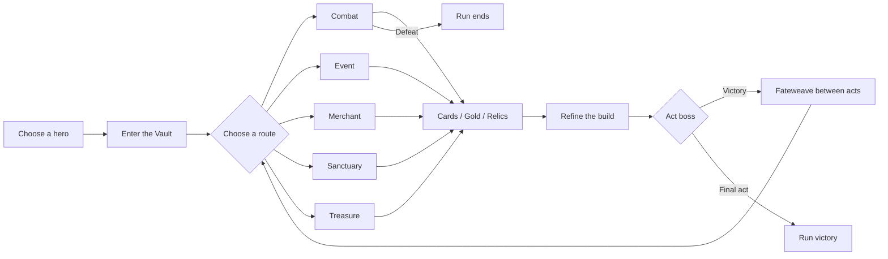
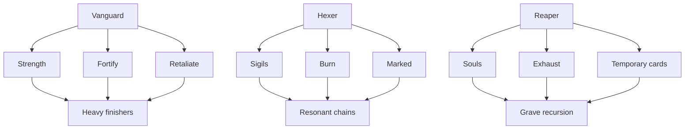
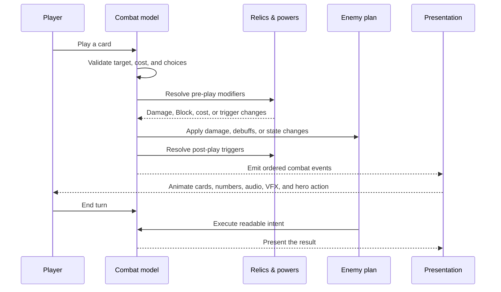
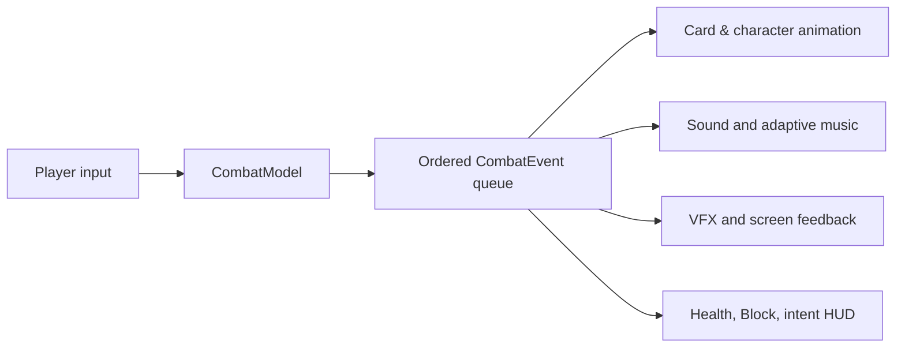
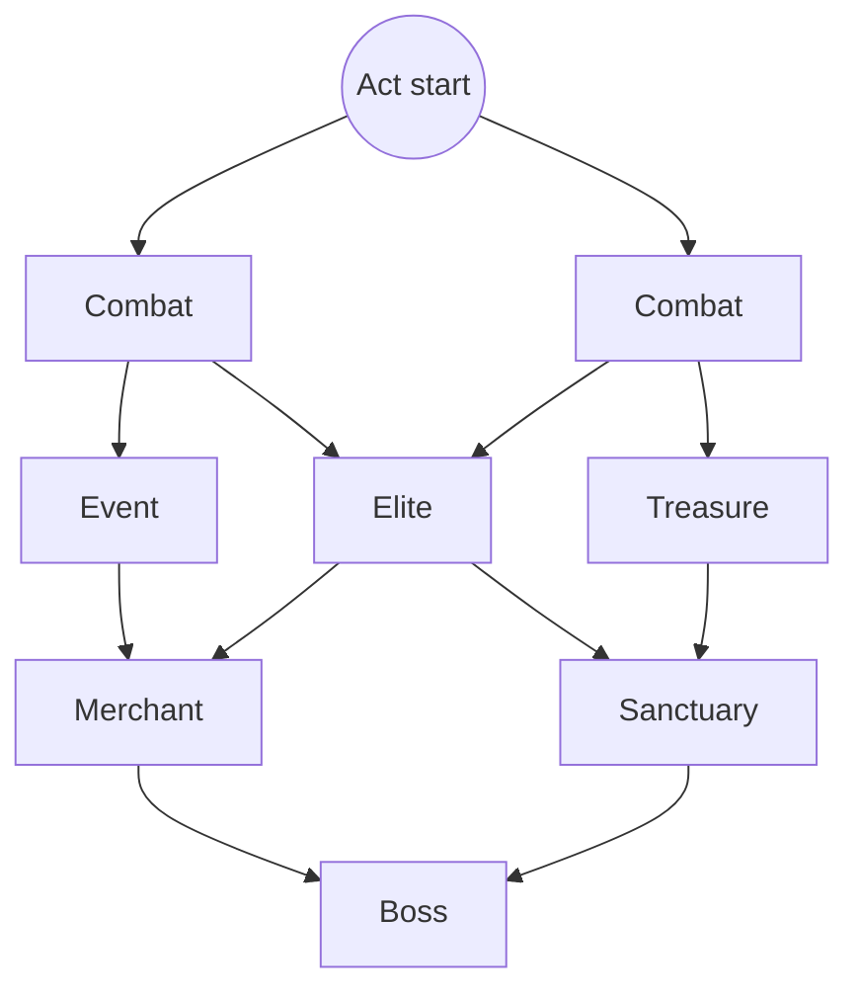
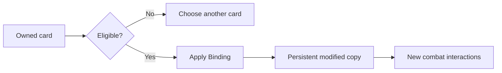
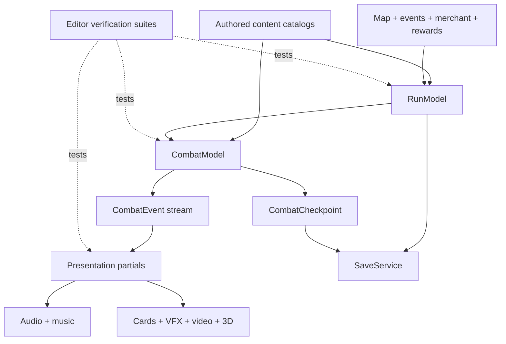

# Gilded Fate

<p align="center">
  
</p>

<p align="center">
  <strong>Choose a champion. Build an impossible deck. Descend into a Vault that remembers every bargain.</strong>
</p>

<p align="center">
  
  
  
  
</p>

**Gilded Fate** is a dark-fantasy roguelike deckbuilder built in Unity. Lead the **Vanguard**, **Hexer**, or **Reaper** through a branching, three-act descent. Read enemy intentions, assemble card engines, bind permanent powers into individual cards, fracture reality with Fate Shards, and survive long enough to challenge the rulers of the Vault.

The repository contains the live game project: gameplay code, maps, encounters, events, cards, relics, character animation, artwork, audio, automated verification, and build tooling.

> The game is under active development. Systems, balance, presentation, and content may change between commits.

## At a glance

| Feature | What it means in play |
|---|---|
| Three playable heroes | Distinct card pools, mechanics, presentation, and animation sets |
| Branching three-act runs | Choose between combat, elites, events, treasure, merchants, sanctuaries, and bosses |
| 250+ authored cards | Character decks, Wanderer cards, curses, statuses, upgrades, and generated cards |
| 90+ relics | Common through Boss-tier build-defining passives |
| 17 enemies | Standard foes, four elites, and three bosses with readable intents |
| 50 authored events | Conditional choices, costs, rewards, transformations, and persistent consequences |
| Deep card modification | Upgrades, Bindings, Fateweaves, permanent growth, and Perfected cards |
| Fate Shards | Limited-use powers that become dangerous Fractured variants |
| Full presentation layer | Adaptive audio, combat VFX, animated health, card motion, 3D scenes, and video heroes |
| Persistence and recovery | Atomic saves, combat checkpoints, deterministic maps, and save-state repair |

## The fantasy

The Vault is a place where wealth, memory, and destiny have fused into one hostile machine. Every chamber offers power at a price. A clean victory may improve the deck; a desperate bargain may rewrite it. The strongest runs are not merely collections of good cards—they are tightly connected systems in which cards, relics, Bindings, Shards, and character mechanics trigger one another.



## Playable heroes

### Vanguard — the iron answer

The Vanguard turns defense into momentum. **Strength**, **Fortify**, **Block**, **Retaliate**, and Heavy attacks reward deliberate sequencing: brace for impact, absorb the enemy turn, then convert stored power into a decisive strike.

**Build directions:** Heavy attacks and cost manipulation; Strength/Fortify feedback loops; Retaliate and Revenge; rapid multi-attack turns; Block conversion and defensive scaling.

### Hexer — the ritual architect

The Hexer builds delayed engines from **Burn**, **Marked**, **Resonance**, curses, and three-slot **Sigils**. The class rewards planning several actions ahead: prepare the board, choose the right Sigil order, then trigger an explosive chain.

**Build directions:** Burn stacking and forced triggers; Marked application and consumption; Ember, Hex, and Echo Sigils; Resonance engines; curse-powered occult strategies.

### Reaper — the grave economy

The Reaper treats the hand, discard pile, and Exhaust pile as one shifting resource. **Souls**, generated cards, Marked targets, sacrifice, and recursion create turns that grow from apparent loss.

**Build directions:** Soul generation and consumption; Exhaust payoffs and retrieval; temporary-card engines; Marked execution chains; graveyard scaling and repeated finishers.



## Combat

Combat is deterministic and intent-driven. Enemies reveal what they plan to do; the challenge is finding the most efficient response while preparing the next turn.

1. Draw a hand and gain Energy.
2. Inspect enemy intents and active effects.
3. Play Attacks, Skills, and Powers in any affordable sequence.
4. Resolve choices, triggered effects, relics, Sigils, and damage events.
5. End the turn and face the enemy plan.
6. Reshuffle when the draw pile is exhausted and continue until one side falls.



### Core combat vocabulary

| Term | Function |
|---|---|
| Block | Absorbs incoming damage, normally before HP is lost |
| Strength | Increases applicable attack damage |
| Fortify | Vanguard defensive resource used by cards and synergies |
| Retaliate | Answers attacks with return damage or enables Revenge effects |
| Burn | Delayed damage that can be stacked, amplified, transferred, or triggered early |
| Marked | Consumable enemy setup used by execution-style effects |
| Resonance | Hexer resource that fuels or rewards ritual chains |
| Sigils | Three-slot persistent combat objects: Ember, Hex, and Echo |
| Souls | Reaper resources generated, played, consumed, or recovered from Exhaust |
| Vulnerable | Increases incoming damage |
| Weak | Reduces outgoing attack pressure |
| Exhaust | Removes a card from the normal draw/discard cycle for that combat |
| Ethereal | A card that disappears if it remains unplayed at turn end |

The simulation and presentation are separated. `CombatModel` owns authoritative state, emits ordered `CombatEvent` records, and the UI consumes those records for animation, sound, hit timing, health playback, and feedback. Combat checkpoints copy the complete simulation state so interrupted encounters remain consistent.



## The route through the Vault

Each act generates a connected map with multiple lanes and guaranteed forward paths. Routes merge and split, making short-term safety compete with long-term build goals.

| Room | Purpose |
|---|---|
| Combat | Standard encounter and core reward source |
| Elite | More dangerous fight with stronger reward potential |
| Event | Authored choice with conditional costs and consequences |
| Treasure | Relic-focused reward room |
| Merchant | Buy cards/relics, remove cards, and use available services |
| Sanctuary | Recover and improve the deck before difficult rooms |
| Boss | Final test of an act and gateway to the next act |



Maps use seeded generation, validate every visible connection, prevent unreachable rooms, and repair undesirable repeated service-room patterns.

## Buildcraft systems

### Cards and upgrades

Cards have an origin, rarity, Energy cost, type, primary effect, optional secondary effect, keywords, and an upgraded form. Owned cards have persistent identities, allowing one copy to be modified without changing every copy of the same card.

Card families include character cards, neutral Wanderer cards, curses, statuses, generated Souls, temporary cards, multi-hit attacks, Powers, Exhaust cards, Ethereal cards, and choice-driven effects.

### Relics

Relics are passive rules that reshape combat. Early relics provide focused bonuses; later relics reward complete engines—ordered card types, mixed origins, trigger categories, repeated Exhaust, exact Energy use, or long attack sequences.

Rarities progress from **Common → Uncommon → Rare → Boss**, with a small Special pool. Boss relics deliver run-defining power with either a major upside or a meaningful restriction.

### Bindings

Bindings permanently attach a rule to one eligible card. Examples include extra damage per hit, additional Block, delayed return to hand, first-play bonuses, recursion after Exhaust, and every-third-play duplication.



### Fateweaves

Between acts, choose one of several Fateweave strands. These can introduce another hero's card, add relics, permanently strengthen selected cards, remove burdens, or Perfect a key piece of the deck. After resolving the chosen strand, an unchosen strand can be cut for Gold.

### Fate Shards

Fate Shards are limited-use artifacts with stable and fractured states. Their first uses are predictable; after repeated use, a Shard becomes Fractured and its effect changes. Events can grant, repair, trade, replace, or deliberately fracture Shards.

### Events

Events are filtered by act, prior appearances, and whether a choice is legal. Outcomes can change Gold, HP, maximum HP, cards, curses, relics, Shards, Bindings, map visibility, Fatewheel results, or temporary multi-combat effects.

## Enemies and bosses

The current roster contains ten standard enemies, four elites, and three bosses.

| Tier | Encounters |
|---|---|
| Standard | Vault Rat, Gilded Sentry, Masked Acolyte, Ash Hound, Coin Mimic, Broken Knight, Rune Mage, Vault Spider, Golden Wisp, Chained Brute |
| Elite | The Executioner, The Mirror Witch, The Golden Beast, The Collector |
| Boss | The Hollow King, The Vault Mother, The Last Dealer |

Enemy behavior is surfaced through intent icons and predicted values. Multi-enemy encounters maintain individual health, Block, statuses, target selection, death handling, and reward resolution.

## Presentation

- Video combat animation sets for Hexer, Vanguard, and Reaper
- Illustrated fallbacks when video is unavailable or Reduce Motion is enabled
- Side-by-side RGB/alpha video reconstruction for transparent playback
- Card travel, impact timing, damage numbers, health interpolation, and layered VFX
- Character-specific run-start transitions and combat reactions
- 3D stage support for heroes, enemies, lighting, and camera composition
- Adaptive music and a categorized sound-effect catalog
- Mouse/keyboard and Xbox navigation
- Fast Mode and Reduce Motion options

Animation preview tools are available under **Gilded Fate → Animation Preview**. Previewing clips does not modify the active run or save.

## Technical architecture



| Area | Important files |
|---|---|
| Content definitions | `Assets/Scripts/Core/GameContent.cs`, `WorldContent.cs`, `EventContent.cs` |
| Run state and map | `Assets/Scripts/Map/RunModel.cs` |
| Combat simulation | `Assets/Scripts/Combat/CombatModel.cs` and its partial modules |
| Events and rewards | `Assets/Scripts/Map/EventSystem.cs`, `RunRewards.cs`, `RunMerchant.cs` |
| Saving | `Assets/Scripts/Saving/SaveService.cs`, `AtomicSaveFile.cs` |
| Main presentation | `Assets/Scripts/UI/GildedMainMenu.cs` and presentation partials |
| Character video | `GildedHexerVideoCombat.cs`, `GildedVanguardVideoCombat.cs`, `GildedReaperVideoCombat.cs` |
| Automated checks | `Assets/Scripts/UI/Gilded*Verification.cs` |
| CI/build entry point | `ci/GildedFateCiBuild.cs` |

### Repository layout

```text
gilded-fate/
├─ Assets/
│  ├─ Editor/                 # Animation preview and editor tools
│  ├─ Resources/              # Art, audio, shaders, models, and fonts
│  ├─ Scenes/                 # Unity scenes
│  ├─ Scripts/
│  │  ├─ Audio/               # Music and sound systems
│  │  ├─ Cards/               # Card asset definitions
│  │  ├─ Combat/              # Deterministic combat simulation
│  │  ├─ Core/                # Cards, relics, enemies, events, and terms
│  │  ├─ Map/                 # Run flow, map, events, shop, and rewards
│  │  ├─ Saving/              # Atomic persistence and profile data
│  │  └─ UI/                  # Presentation, controls, VFX, video, verification
│  └─ StreamingAssets/        # Runtime video and third-party credits
├─ Packages/                  # Unity package manifest and lockfile
├─ ProjectSettings/           # Shared Unity configuration
├─ Docs/                      # Focused technical documentation
└─ ci/                        # Windows, WebGL, and trailer build tooling
```

## Run the project

### Requirements

- Unity Hub
- Unity **6000.5.9f1**
- Git and Git LFS
- Windows Build Support for a Windows executable

### Setup

```bash
git clone https://github.com/riverhine1-max/gilded-fate.git
cd gilded-fate
git lfs install
git lfs pull
```

1. Add the repository folder in Unity Hub.
2. Open it with Unity `6000.5.9f1`.
3. Allow Unity to restore packages and import assets.
4. Open `Assets/Scenes/SampleScene.unity`.
5. Enter Play mode.

> Do not use GitHub's source ZIP for a complete checkout. Large artwork, audio, models, and combat videos are stored with Git LFS; a ZIP may contain pointer text instead of the real assets.

## Controls and playtesting

The game supports mouse/keyboard and Xbox controller input. Start a **new run** to see the selected hero's run-start transition; **Continue** resumes the saved state without replaying it.

Suggested smoke test:

1. Start one run with each hero.
2. Verify targeting, intents, damage, Block, and end-turn flow.
3. Trigger the hero's signature mechanic.
4. Visit a merchant, sanctuary, event, and treasure room.
5. Save and continue the run.
6. Reach a boss and confirm post-act Fateweave flow.
7. Repeat with Reduce Motion and with an Xbox controller.

## Build a Windows playtest

Open **File → Build Profiles**, select **Windows**, include `Assets/Scenes/SampleScene.unity`, and build into a local `Builds` directory. Keep the executable and all generated data files together.

The editor entry point `GildedFate.Editor.GildedFateAutomatedBuild.BuildWindows` creates a development build in `Builds/VisualCheck`. Cloud-oriented Windows, WebGL, and trailer-player workflows live under `.github/workflows` and `ci`.

## Verification philosophy

The project includes targeted editor verification suites for combat rules, saves, maps, shops, UI navigation, Xbox input, accessibility modes, animation playback, audio, relics, Shards, Bindings, completion, and content expansions.

When changing gameplay:

- Keep the model authoritative and deterministic.
- Emit presentation events instead of mutating UI state from the simulation.
- Preserve persistent card IDs and Unity `.meta` files.
- Verify save migration and checkpoint restoration.
- Test normal motion, Reduce Motion, keyboard/mouse, and controller paths.

## Large files and asset integrity

Git LFS is required for runtime media. If an asset opens as a small text file beginning with `version https://git-lfs.github.com/spec/v1`, run:

```bash
git lfs install
git lfs pull
```

Runtime animation videos intentionally store color and alpha side by side. Packed-alpha shaders in `Assets/Resources` reconstruct the transparent cutout.

## Credits and rights

Third-party audio credits are in `Assets/StreamingAssets/AUDIO_CREDITS.txt`. Font licenses and other notices are under `Assets/StreamingAssets/ThirdParty`.

No open-source license is granted for the original Gilded Fate game code or assets. Third-party components remain subject to their respective licenses.

---

<p align="center"><em>Every card is a promise. Every relic remembers. Every path has a price.</em></p>
